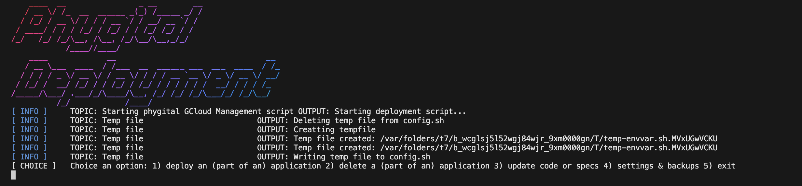

= Phygital Deployment: Documentation

== Prerequisites

* A Google Cloud Platform account with billing enabled
* A computer with a command line interface that supports bash
* A config.sh file with *correct* information (more about this later)
* Google Cloud SDK installed on your computer
* A Cloudflare registered domain name 

note: the automatic DNS record creation integrated in the script only works with Cloudflare. If you have a different DNS provider, you will have to create the DNS records manually.

== The result of the script

The script deploys a load balanced dotNET application to Google Cloud. The application is deployed in a managed instance group with autoscaling enabled. 
The script also creates a Cloud SQL database with a private ip (public IP instead is optional) and a Cloud Storage bucket. 

The script also automatically creates a DNS record for the domain name you set in the config file in Cloudflare to point to the load balancer . 

Optional options that can be enabled are:
* Cloud CDN
* Database backups
* upgrade the specifications of the VMs (storage focus, performant focus, balanced focus)
* upgrade the amount of replicas in the instance group

== Explanation of the content of the deployment folder

The deployment folder contains the following folders and files:

* a folder lib that holds all the bash files with the functions organised by topic
* a folder logs where you can find all the logs of the last run of the script
* the source_scripts script, that sources all the functions in lib folder needed to run the script
* the start.sh file that is the main file to run the script, from there on you can navigate around to choose what you want to do
* the config.sh file that holds all the configuration data
* the config.sh.template file that is a template for the config file
* the startup script file that is used to start the application and added to the VM when creating the template

== The config file

The config is the most important file for running the script.
In the same folder that holds this README file there is a template file (called config.sh.template) already configured with the correct syntax. Please review this template and rename it to "config.sh" before running the script. 

Review all the data before running the script
Make sure that:
- The project name is unique
- If applicable, the cloudflare api token, zone id and account email is set up 
- The domain name is correct
- the Git URL is correct
- You entered the correct GIT_TOKEN 

== Running the script

=== What does the script do exactly

The script is a collection of functions that make the deployment of an Dotnet application to Google Cloud as easy as running 1 command. With extra options to make the deployment even more customisable.

=== How to run the script

If you confirmed all the credentials in the config file are correct, you can now run the script by executing the following command in the terminal:

[source,bash]
bash start.sh

You are then prompted with the following header and options to choose from 

From here on you can choose to:

* Deploy a new applicatoon, or deploy parts of an application (like only the database)
* Delete an existing application, or parts of it (like only the load balancing part)
* Update an existing application (code or specifications)
* Change settings like database backups or enable Cloud CDN

When you chose to deploy or delete an application, you can chose to either deploy/delete fully or only partly (like database, cloud storage bucket network)

If for some reason you still want to do a specific action, you can choose to add the functuons into the file test.sh (but this requires an understanding of the code base and the functions in the lib folder)

DISCLAIMER: The Network can only be delete if everything else have been brought down. Also the load balancing is deleted in a specific order which cannot be messed with.

In the settings you can choose between the following options:

You navigate through the settings by choosing the number of the option you want to change

* database backups
    . create a backup
    . restore a backup
    . list all the backups
* project settings
    . set the default project
    . set the default region
* instance group settings
    . enable Cloud CDN
    . disable Cloud CDN
    . upgrade max replicas

The script is build in a way that it shows the output of the script to the screen & to a log file (named: logs/logfile_<date>_<hour>.txt).
What you will see on the screen is something like this:

Structured like this
[ Type of message] Topic: "topic of the step of the running script" Output: Extra information about the step

The extra output from the Google commands can be find in the log file

=== the startup script

This script helps when starting upt the VMs. It is added to the VM when creating the template. It is a simple script that starts the application in a systemd unit. 